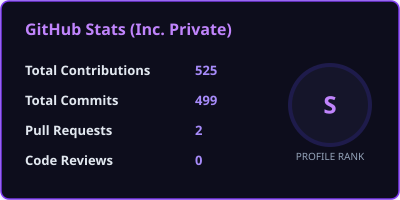
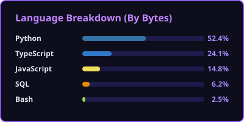

  
# ✦ Janay Rawal ✦

 

 

---

### 🚀 About Me

I design and build backend systems, AI-powered web applications, and practical developer tools. My daily engineering workflows revolve around FastAPI, Next.js, TypeScript, vector databases, and LLM orchestration, with a strong focus on clean architecture, scalable API design, and reliable RAG pipelines.

* 🎓 **Education:** B.Tech in Electronics & Telecommunication, Symbiosis Institute of Technology, Pune *(Graduated June 2026)*
* 💼 **Experience:** Software Engineer Intern @ **Luminosity Software Limited** & Active Contract Freelance Developer
* 🛠️ **Core Focus:** Developing structured backend APIs, reliable LLM retrieval workflows, and type-safe modern web architectures
* 📐 **Engineering Philosophy:** Clear abstraction boundaries, predictable state management, comprehensive type safety, and practical debugging

---

> [!TIP]
> ### 🤖 Chat with my AI Portfolio Assistant
> You can converse directly with my custom RAG AI assistant to explore my projects, technical implementations, system architectures, and engineering decisions.
>
> 🌐 **[Launch AI Assistant at janayrawal.in →](https://www.janayrawal.in)**

---

### ⚡ Featured Projects

| Project | Tech Stack | Technical Implementation & Architecture |
| :--- | :--- | :--- |
| **[🌐 HYMN Platform](https://hymn-platform.vercel.app/)** | `Next.js` `TypeScript` `PostgreSQL` `Prisma` | Production client SaaS platform implemented with Edge-based RBAC authorization, secure JWT session handling, and server-mediated Vercel Blob storage pipelines. |
| **[🤖 Portfolio Assistant](https://www.janayrawal.in)** | `FastAPI` `ChromaDB` `Gemini` `Next.js` | Custom RAG assistant and retrieval pipeline featuring token streaming via Server-Sent Events (SSE) and dynamic sliding-memory conversational context. *[Private Repository]* |
| **[📊 SQL Intelligence](https://github.com/Janay-Rawal/Chat-with-SQLDB)** | `FastAPI` `LangChain` `Groq Llama` `Recharts` | Natural language database query interface emphasizing schema-aware retrieval, automated SQL generation and validation, LRU query caching, and automated Recharts visualization. |
| **[🔎 API Inspector](https://github.com/Janay-Rawal/API-Inspector)** | `Streamlit` `Playwright` `BeautifulSoup` | Local-first crawling and endpoint discovery utility built with Playwright for routing verification, HTTP response schema validation, and automated API documentation generation. |

---

### 🛠️ Technical Arsenal

   
  
    

| Domain | Core Technologies & Tooling |
| :--- | :--- |
| **💬 Languages & Frameworks** | Python · TypeScript · JavaScript · SQL (PostgreSQL, SQLite) · FastAPI · Next.js · React |
| **🧠 AI & LLM Systems** | Vector Embeddings · RAG Pipelines · LLM Orchestration · NLP · Transformers · LangChain |
| **🗄️ Databases & Cloud Infra** | PostgreSQL · ChromaDB · MongoDB · Neo4j · Docker · Microsoft Azure · AWS · Git · Linux |
| **📈 Tooling & Data Workflows** | Playwright · Prisma · Pandas · NumPy · Power BI · Power Automate |

---

### 📈 GitHub Metrics & Activity

   
  
  &nbsp;&nbsp;
  
    
  

